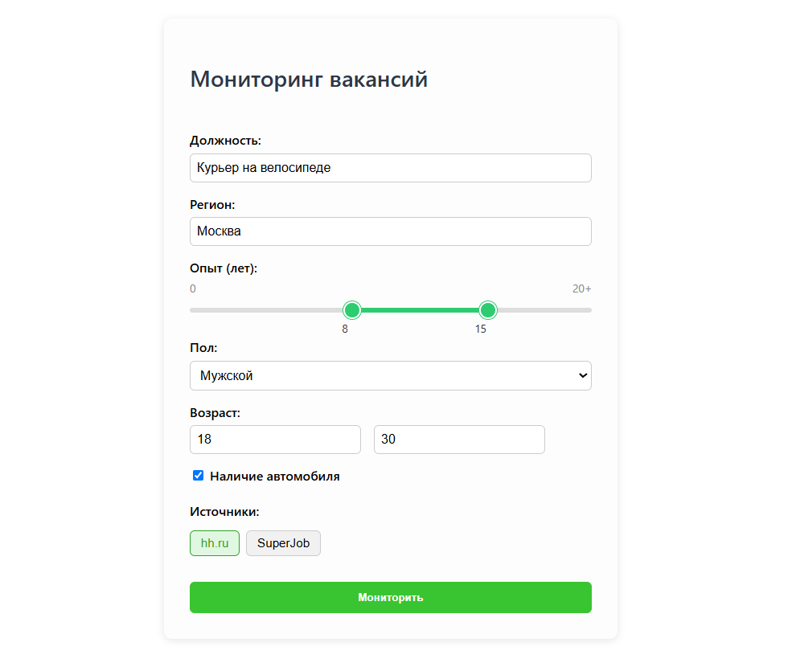
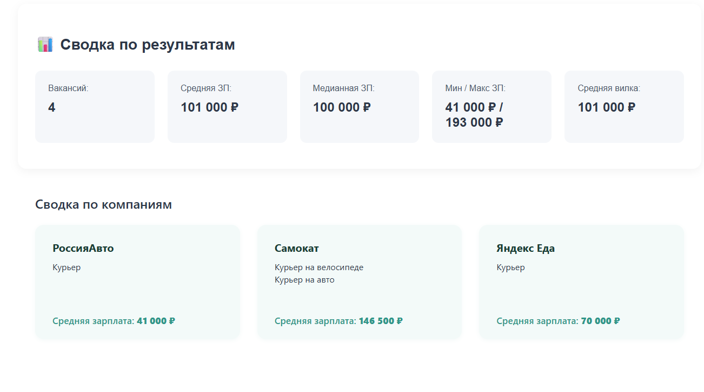

# ИИ-МОНИТОРИНГ ЗАРПЛАТ

### Команда: Формула Шаурмы

#### 🎯 Задача:

HR-аналитика и управление компенсациями –
автоматизация мониторинга рынка труда,
заработных плат и условий найма по разным
позициям в разных регионах, с использованием ИИ
и кастомизируемых источников данных

---

_**В итоге ускоряем аналитику вакансий с 6 часов до 10 минут
с помощью машинного обучения**_

---

#### 🛠 Что используем?:
- Фронтенд: ReactJS
- Бэкенд: Flask
- ML: Pytorch, Sklearn Kmeans

---

#### 🖼️ Скриншоты:

##### Ввод фильтров сотрудником:

##### Получаемый результат:

